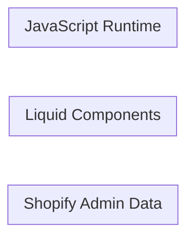
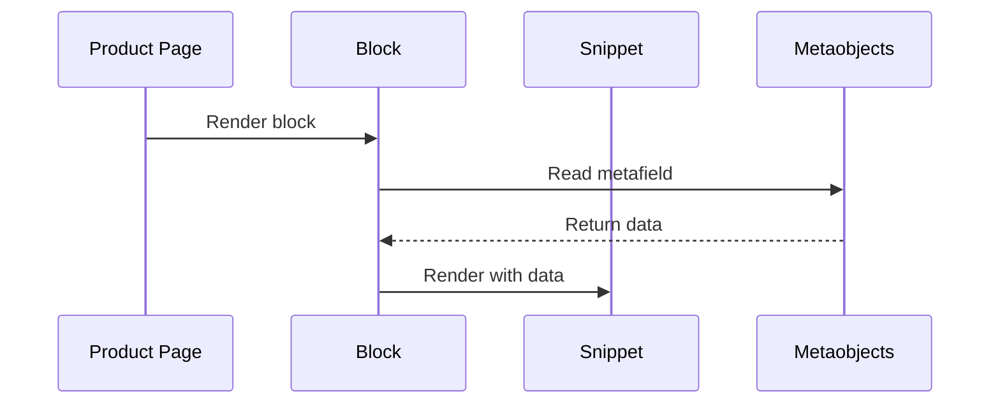

# Feature Name

One-paragraph summary: what the feature does, where it appears, and what data drives it.

---

## Architecture



## File Structure

| File | Action | Purpose |
|------|--------|---------|
| `blocks/example.liquid` | Created | Block description |
| `snippets/example.liquid` | Created | Snippet description |
| `assets/example.js` | Created | JS component description |
| `locales/en.default.schema.json` | Modified | Schema translation keys |

> **Action column**: Use `Created` for new files, `Modified` for existing files that were changed. Omit the column entirely if all files were created for this feature.

## Metaobject Structure

### `metaobject_handle`

| Field | Key | Type | Description |
|-------|-----|------|-------------|
| Display Name | `key` | Type | What it stores |

### Product Metafields

| Namespace | Key | Type | Description |
|-----------|-----|------|-------------|
| `namespace` | `key` | Metaobject reference (`type`) | What it links to |

> Omit this section if the feature does not use metaobjects or metafields.

## Data Flow



## Implementation Details

Subsections as needed for Liquid, JavaScript, and CSS. Use numbered subsections for complex features with multiple moving parts.

### Liquid Components

#### Block: Example Block

**File:** `blocks/example.liquid`

Brief description of what the block does and how it accesses data.

**Settings:**

| Setting | Type | Default | Description |
|---------|------|---------|-------------|
| `setting_id` | Type | `default` | What it controls |

#### Snippet: Example Snippet

**File:** `snippets/example.liquid`

Brief description of what the snippet renders.

**Parameters:**

| Parameter | Type | Description |
|-----------|------|-------------|
| `param` | Type | What it provides |

### JavaScript

> Omit if no JS is involved.

### CSS Classes

> Omit if no custom styles are defined.

| Class | Description |
|-------|-------------|
| `.feature-name` | Container |
| `.feature-name__element` | Element description |
| `.feature-name__element--modifier` | Modifier description |

#### CSS Custom Properties

| Property | Description | Default |
|----------|-------------|---------|
| `--custom-prop` | What it controls | `value` |

## Schema Settings

JSON example of settings added to sections or blocks:

```json
{
  "type": "select",
  "id": "setting_id",
  "label": "t:settings.setting_id",
  "options": [
    { "value": "option_a", "label": "t:options.option_a" },
    { "value": "option_b", "label": "t:options.option_b" }
  ],
  "default": "option_a"
}
```

## Translations

**Schema translations** (`locales/*.schema.json`):

| Key | EN |
|-----|-----|
| `names.feature_name` | Feature Name |
| `settings.setting_id` | Setting label |

**UI translations** (`locales/*.json`):

| Key | EN |
|-----|-----|
| `section.key` | Text |

> Omit UI translations row if none exist. Omit the entire section only if no translation keys were added.

## Accessibility

- **Semantic HTML:** Elements used and why
- **ARIA attributes:** Any `aria-label`, `aria-current`, roles
- **Keyboard:** Navigation and focus management
- **Screen readers:** How content is announced

> Every feature should document its accessibility considerations, even if minimal.

## Setup Requirements

> Omit if no Shopify Admin setup is needed beyond adding the section/block in the theme editor.

1. **Step one**

2. **Step two**

## Verification Checklist

- [ ] Primary happy path works
- [ ] Edge case: missing data falls back gracefully
- [ ] Mobile behavior
- [ ] Accessibility (keyboard, screen reader)

## Dependencies

- [Related Feature](./related-feature.md) — what it shares or depends on

> Omit if the feature is fully standalone.
