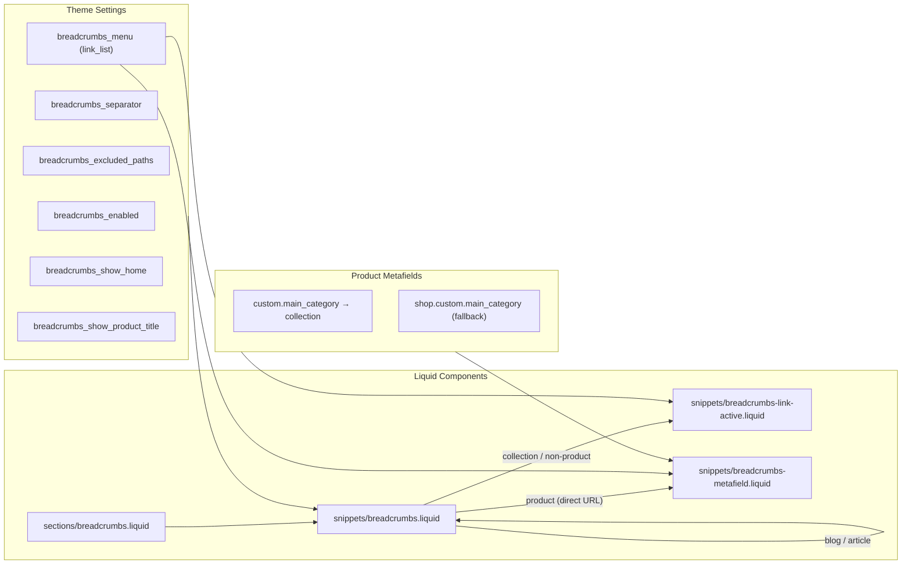
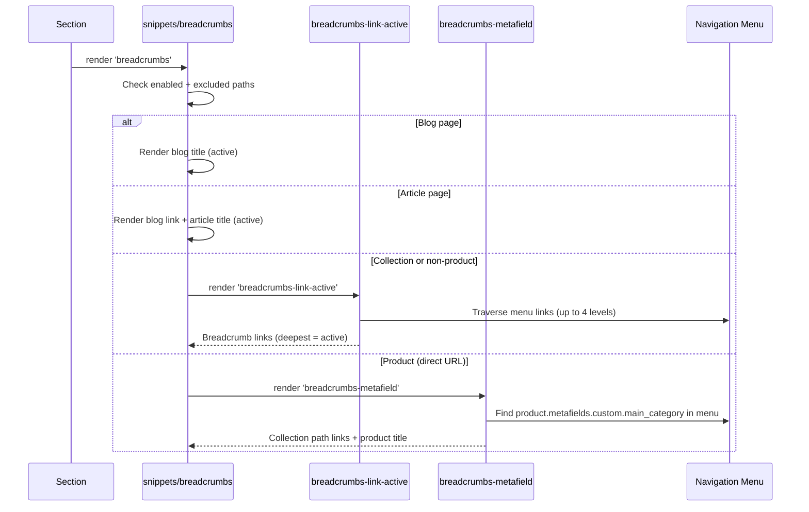

# Breadcrumbs

Navigation breadcrumbs that appear on collection, product, blog, and article pages. Breadcrumb hierarchy is driven by a configurable Shopify navigation menu, with a special metafield-based path for product pages accessed directly (not through a collection URL).

---

## Architecture



## File Structure

| File | Action | Purpose |
|------|--------|---------|
| `sections/breadcrumbs.liquid` | Created | Section wrapper; renders the `breadcrumbs` snippet with color scheme and padding |
| `snippets/breadcrumbs.liquid` | Created | Main routing logic; determines page type and delegates to the correct sub-snippet |
| `snippets/breadcrumbs-link-active.liquid` | Created | Menu-traversal breadcrumbs for collections and other non-product pages |
| `snippets/breadcrumbs-metafield.liquid` | Created | Metafield-driven breadcrumbs for product pages accessed via direct URL |
| `config/settings_schema.json` | Modified | Breadcrumbs settings group added |
| `locales/en.default.json` | Modified | `general.breadcrumbs.*` UI translation keys added |
| `locales/en.default.schema.json` | Modified | `names.breadcrumbs`, `settings.breadcrumbs_*`, `info.breadcrumbs_*` keys added |

## Data Flow



## Implementation Details

### Snippet: breadcrumbs (main router)

**File:** `snippets/breadcrumbs.liquid`

Determines whether to show breadcrumbs (checks `breadcrumbs_enabled` and `breadcrumbs_excluded_paths`), then routes to the appropriate rendering strategy based on template type:

| Template | Strategy |
|----------|----------|
| `blog` | Inline: Home > Blog Title (active) |
| `article` | Inline: Home > Blog Title (link) > Article Title (active) |
| `product` via collection URL | `breadcrumbs-link-active` (menu traversal) |
| `product` via direct URL | `breadcrumbs-metafield` (metafield lookup) |
| Everything else (collections, pages, etc.) | `breadcrumbs-link-active` (menu traversal) |

The routing condition: if the template is not `product` OR the URL contains `/collections/`, it uses menu traversal. Otherwise it uses the metafield approach.

The template name is normalized with `template | split: '.' | first` to handle alternate templates (e.g. `product.featured` → `product`).

Also outputs JSON-LD `BreadcrumbList` structured data for blog and article templates.

### Snippet: breadcrumbs-link-active

**File:** `snippets/breadcrumbs-link-active.liquid`

Traverses the navigation menu configured in `settings.breadcrumbs_menu` up to 4 levels deep. Uses Shopify's `link.active` and `link.child_active` properties to find the current page's position in the menu hierarchy.

- For each level, captures both a linked version and an active (no-link) version
- The deepest matching level renders as active text (no link) unless the page is a product page (always linked)
- Uses `` after finding the active branch at each level for performance

Also outputs JSON-LD `BreadcrumbList` at the end, including the product title when on a product page.

### Snippet: breadcrumbs-metafield

**File:** `snippets/breadcrumbs-metafield.liquid`

Used when a product page is accessed directly (not through a collection). Resolves the product's main category collection and finds its position in the navigation menu:

1. Reads `product.metafields.custom.main_category` (falls back to `shop.metafields.custom.main_category`)
2. Traverses the menu looking for a `collection_link` whose handle matches
3. Builds the breadcrumb path from root to the matching collection
4. Appends the product title as the final breadcrumb when `settings.breadcrumbs_show_product_title` is enabled

Only processes `collection_link` type menu items (non-collection links are skipped).

Also outputs JSON-LD `BreadcrumbList` at the end.

### CSS Classes

All CSS is scoped via `` in `snippets/breadcrumbs.liquid`.

| Class | Description |
|-------|-------------|
| `.breadcrumbs` | Inner flex container for breadcrumb items; horizontally scrollable on overflow |
| `.breadcrumbs__item` | Individual breadcrumb (link or text) |
| `.breadcrumbs__item--active` | Non-product deepest level (no link); rendered at 60% opacity |
| `.breadcrumbs__item--current` | Product title in metafield breadcrumbs; rendered at 60% opacity |
| `.breadcrumbs__separator` | Separator character between levels (`aria-hidden="true"`) |
| `.breadcrumbs__wrapper` | Section-level wrapper with responsive padding via `spacing-style` |

## Global Theme Settings

Settings group added to `config/settings_schema.json`:

| Setting | Type | Default | Description |
|---------|------|---------|-------------|
| `breadcrumbs_enabled` | checkbox | `true` | Global toggle for breadcrumbs |
| `breadcrumbs_separator` | text | `/` | Character(s) between breadcrumb levels |
| `breadcrumbs_show_home` | checkbox | `true` | Show "Home" link as the first breadcrumb |
| `breadcrumbs_show_product_title` | checkbox | `true` | Show the product title as the last breadcrumb on product pages (metafield path only) |
| `breadcrumbs_menu` | link_list | — | Navigation menu used to build the breadcrumb hierarchy |
| `breadcrumbs_excluded_paths` | textarea | — | Comma-separated paths to hide breadcrumbs on |

## Section Settings

The section `sections/breadcrumbs.liquid` exposes color and padding settings:

| Setting | Type | Default | Description |
|---------|------|---------|-------------|
| `color_scheme` | color_scheme | `scheme-1` | Color scheme for text and background |
| `padding-block-start` | range (0–100px) | `16` | Top padding |
| `padding-block-end` | range (0–100px) | `16` | Bottom padding |

Padding is applied via the `spacing-style` snippet, which outputs responsive CSS variables with fluid scaling above 20px.

## Metafields Required

| Owner | Namespace | Key | Type | Description |
|-------|-----------|-----|------|-------------|
| Product | `custom` | `main_category` | Collection (single) | The product's primary collection, used to build the breadcrumb path on direct product URLs |
| Shop | `custom` | `main_category` | Collection (single) | Fallback if the product metafield is not set |

## Structured Data (JSON-LD)

Each breadcrumb path outputs a `BreadcrumbList` schema.org JSON-LD script for SEO rich results:

| Template | JSON-LD source |
|----------|---------------|
| Blog | `snippets/breadcrumbs.liquid` |
| Article | `snippets/breadcrumbs.liquid` |
| Collection / non-product | `snippets/breadcrumbs-link-active.liquid` |
| Product via collection URL | `snippets/breadcrumbs-link-active.liquid` (includes product title) |
| Product via direct URL | `snippets/breadcrumbs-metafield.liquid` |

Position numbers are computed dynamically. All string values use `| json` for safe escaping.

Example output:
```json
{
  "@context": "https://schema.org",
  "@type": "BreadcrumbList",
  "itemListElement": [
    { "@type": "ListItem", "position": 1, "name": "Home", "item": "https://example.com/" },
    { "@type": "ListItem", "position": 2, "name": "Drinks", "item": "https://example.com/collections/drinks" },
    { "@type": "ListItem", "position": 3, "name": "Kombucha", "item": "https://example.com/collections/kombucha" }
  ]
}
```

## Translations

**Schema translations** (`locales/en.default.schema.json`):

| Key | EN |
|-----|-----|
| `names.breadcrumbs` | Breadcrumbs |
| `settings.breadcrumbs_enabled` | Enable breadcrumbs |
| `settings.breadcrumbs_separator` | Separator |
| `settings.breadcrumbs_show_home` | Show home link |
| `settings.breadcrumbs_show_product_title` | Show product title |
| `settings.breadcrumbs_menu` | Menu |
| `settings.breadcrumbs_excluded_paths` | Excluded paths |
| `info.breadcrumbs_menu` | Select the navigation menu used to build the breadcrumb hierarchy. |
| `info.breadcrumbs_excluded_paths` | Enter paths to hide breadcrumbs on, separated by commas. |

**UI translations** (`locales/en.default.json`):

| Key | EN |
|-----|-----|
| `general.breadcrumbs.label` | Breadcrumb |
| `general.breadcrumbs.home` | Home |

## Accessibility

- **Semantic HTML:** Uses `<nav>` as landmark, `<a>` elements for navigable links, `<span>` for active/current items
- **ARIA landmark:** Wrapped in `<nav aria-label="{{ 'general.breadcrumbs.label' | t }}">` for screen reader navigation
- **Current page:** Active breadcrumb items have `aria-current="page"`
- **Separators:** All separators have `aria-hidden="true"` to prevent screen reader noise
- **Home link:** Includes `title` attribute for additional screen reader context

## Setup Requirements

1. **Create a navigation menu** in Shopify Admin > Online Store > Navigation
   - Structure the menu to mirror the site hierarchy (up to 4 levels deep)
   - Use collection links for product breadcrumb resolution

2. **Assign the menu** in Theme Settings > Breadcrumbs > Menu

3. **Create product metafield definition** in Shopify Admin > Settings > Custom data > Products
   - Namespace: `custom`, Key: `main_category`
   - Type: Collection reference (single)
   - Enable Storefront API access

4. **Create shop metafield definition** in Shopify Admin > Settings > Custom data > Shop
   - Namespace: `custom`, Key: `main_category`
   - Type: Collection reference (single)
   - Enable Storefront API access

5. **Assign `custom.main_category`** on products that need breadcrumbs via direct URL

6. **Add the Breadcrumbs section** to page templates via the theme editor

## Verification Checklist

- [ ] Breadcrumbs show on collection pages following the menu hierarchy
- [ ] Product pages via collection URL show collection-based breadcrumbs
- [ ] Product pages via direct URL show metafield-based breadcrumbs
- [ ] Blog pages show: Home > Blog Title (active)
- [ ] Article pages show: Home > Blog Title (link) > Article Title (active)
- [ ] Excluded paths correctly hide breadcrumbs
- [ ] Custom separator character renders correctly
- [ ] Disabling breadcrumbs (theme setting) hides them globally
- [ ] Products without `main_category` metafield fall back to shop-level metafield
- [ ] `aria-current="page"` present on active breadcrumb
- [ ] JSON-LD `BreadcrumbList` visible in page source
- [ ] Color scheme applies correctly
- [ ] Padding sliders adjust top/bottom spacing
