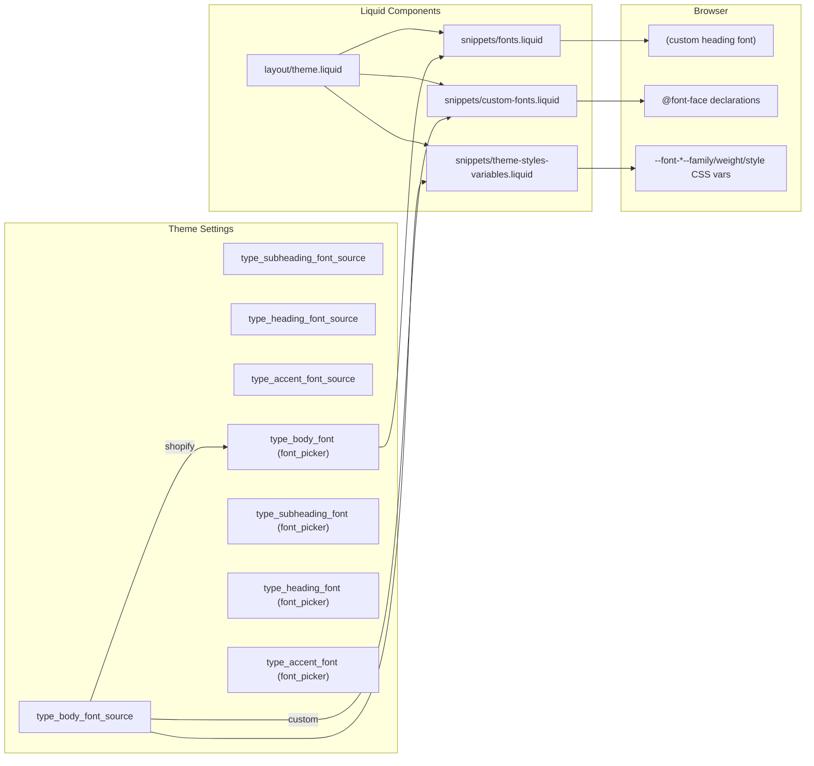

# Typography

Custom fonts system that allows merchants to choose between Shopify's built-in font picker and a curated set of project custom fonts, configured under Theme Settings → Typography → Fonts.

---

## Architecture



## File Structure

| File | Action | Purpose |
|------|--------|---------|
| `snippets/custom-fonts.liquid` | Created | Loads `@font-face` and preload tags for custom fonts |
| `snippets/theme-styles-variables.liquid` | Modified | Font family CSS vars now branch on `*_font_source` setting |
| `layout/theme.liquid` | Modified | Added `render 'custom-fonts'` after `render 'fonts'` |
| `config/settings_schema.json` | Modified | Added 4 font source selects + `visible_if` on font pickers |
| `locales/en.default.schema.json` | Modified | Added `settings.*_font_source`, `options.shopify_fonts`, `info.shopify_font_picker` |
| `assets/Arthura-Regular.woff2` | Added | Arthura weight 400 |
| `assets/Arthura-Medium.woff2` | Added | Arthura weight 500 |
| `assets/Arthura-Bold.woff2` | Added | Arthura weight 700 |
| `assets/Boldonse.woff2` | Added | Boldonse weight 400 |
| `assets/SelfieNeueRounded-Regular.woff2` | Added | Selfie Neue Rounded weight 400 |

## How It Works

### Font source selection

Each of the four font roles (body, subheading, heading, accent) has a `*_font_source` select setting. Default is `"shopify"`, which shows the native Shopify font picker and uses `font_face` / `font_url` Liquid filters. Any other value selects a custom font.

### Custom font loading (`snippets/custom-fonts.liquid`)

1. **Preload** — If the heading font is custom, outputs a `<link rel="preload">` for the heading font file. This is critical for LCP since headings are typically above the fold.
2. **Collect** — Loops through all four font sources collecting which custom fonts are needed. If body uses Arthura, also schedules `arthura:500` (buttons) and `arthura:700` (rich text bold) for loading.
3. **Deduplicate** — `| uniq | compact` ensures the same font file is never loaded twice even if selected for multiple roles.
4. **Emit** — Outputs `@font-face` declarations only for fonts in use, inside `...`.

### CSS variable generation (`snippets/theme-styles-variables.liquid`)

The font family block is conditional per source:
- `shopify` → reads `.family`, `.fallback_families`, `.weight`, `.style` from the Shopify font object
- custom → parses `font-name:weight` value, maps name to `font-family` string, sets style to `normal`

Output variables consumed by the rest of the theme:
```css
--font-body--family    --font-body--style    --font-body--weight
--font-subheading--family ...
--font-heading--family ...
--font-accent--family ...
```

## Available Custom Fonts

| Font | Value | Weights available |
|------|-------|-------------------|
| Selfie Neue Rounded | `selfie-neue-rounded:400` | 400 |
| Boldonse | `boldonse:400` | 400 |
| Arthura | `arthura:400` | 400 |
| Arthura Bold | `arthura:700` | 700 |

> Arthura Medium (500) is loaded automatically when Arthura is selected as body font — used for button font weight.

## Adding a New Custom Font

1. **Upload** the `.woff2` file to `assets/`
2. **Add option** to the 4 `select` settings in `config/settings_schema.json` (value format: `font-name:weight`)
3. **Add `@font-face` case** in `snippets/custom-fonts.liquid` under the `case font_name` block
4. **Add family case** in `snippets/theme-styles-variables.liquid` under all 4 `case body_font_name` / `case heading_font_name` etc. blocks
5. If the font has multiple weights (like Arthura), add auto-load logic in the body font section of `custom-fonts.liquid`

## Translations

**Schema translations** (`locales/en.default.schema.json`):

| Key | EN |
|-----|-----|
| `settings.body_font_source` | Body font |
| `settings.subheading_font_source` | Subheading font |
| `settings.heading_font_source` | Heading font |
| `settings.accent_font_source` | Accent font |
| `options.shopify_fonts` | Shopify fonts |
| `info.shopify_font_picker` | Only shown when 'Shopify fonts' is selected |

## Verification Checklist

- [ ] Theme Settings → Typography → Fonts shows 4 source selects with custom font options
- [ ] Selecting "Shopify fonts" shows the native font picker below; selecting a custom font hides it
- [ ] Selecting "Boldonse" as Heading font changes headings to Boldonse in the preview
- [ ] Page source shows `@font-face` only for the selected custom font(s)
- [ ] Page source shows `<link rel="preload">` for the heading custom font in `<head>`
- [ ] Switching back to "Shopify fonts" removes the `@font-face` and preload
- [ ] Same font selected for two roles loads `@font-face` only once (deduplication)
- [ ] Arthura as body font auto-loads Arthura Medium (500) and Bold (700) variants
